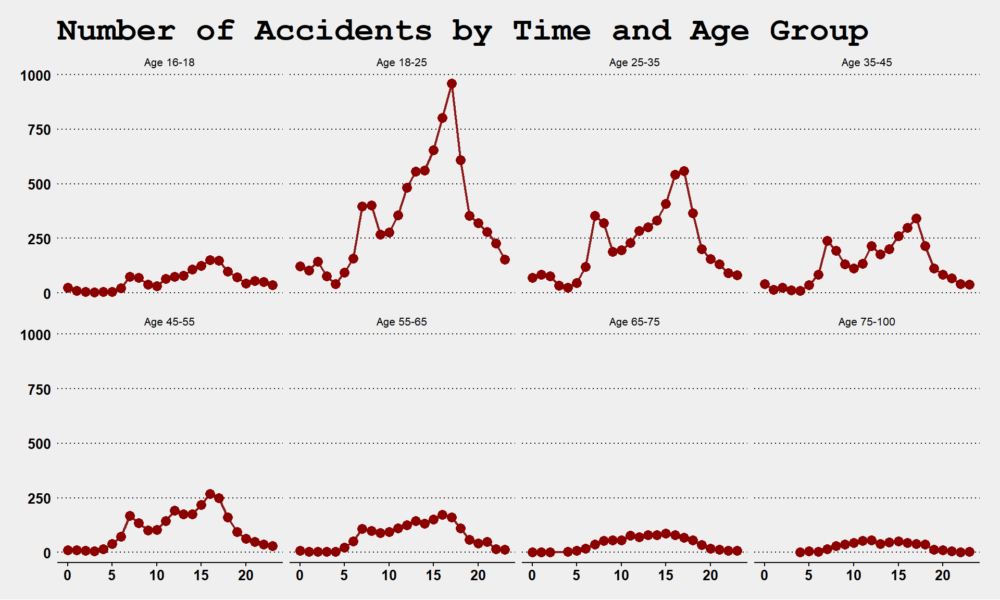
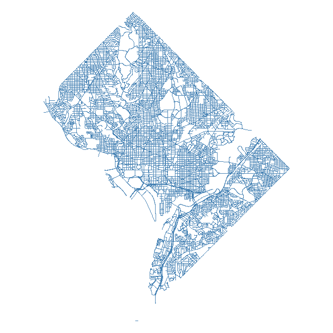

 
<!--- 
New sections start with 2 stars:  ** Section Title
New units start with 3 stars:     *** {Unit Metadata}
-----------------------------start example
** Section-I
*** { @unit = "15th Nov", @title = "Course Overview", @reading, @lecture, @assignment, @foldout }
-----------------------------end example
Unit Metadata is comprised of:
@unit - date or number
@title - unit name
@reading - turn on reading icon
@assignment - turn on lecture icon
@lecture - turn on lecture icon
@foldout - activate unit content (allow foldout)
Submit Buttons - 
  <a class="uk-button uk-button-primary" href="{{page.canvas.assignment_url}}">Submit Lab</a>
  <a class="uk-button uk-button-primary" href="{{page.canvas.yellowdig_url}}">YELLOWDIG</a>
-->


** Welcome


*** { @unit = "", @title = "Course Overview",  @foldout   }

<br> 

## Welcome Back!

CPP 527 is the second course in the Foundations of Data Science sequence. This semester 

<br>
<br>


*** { @unit = "", @title = "Getting Help", @assignment, @foldout  }


## Getting Help

Note that the discussion board is hosted by the GitHub issues feature. It is a great forum because:

* You can format code and math using standard markdown syntax. 
* You can cut and paste images directly into the message. 
* You can direction responses using @username mentions. 

Please preview your responses before posting to ensure proper formatting. Note that you format code by placing fences around the code:

````
```
# your code here
lm( y ~ x1 + x2 )
```
````

The fences are three back-ticks. These look like quotation marks, but are actually the character at the top left of your keyboard (if you have a US or European keyboard). 

GitHub does not have a native math rendering language (RMD documents, on the other hand, [support formulas](https://www.calvin.edu/~rpruim/courses/s341/S17/from-class/MathinRmd.html)). So you have two options, type formulas as regular text and use code formatting to make them clear (this option is usually sufficient). Or you can type your formula in a formula editor and copy and paste an image of the nicely-formatted example.  

````
```
y = b0 + b1•X1 + b2•X2 + e

b1 = cov(x,y) / var(x)
```
````

----

These courses are designed to be interactive, and a lot of learning occurs by practicing the technical jargon from the field and learning how to talk about data and models. 

Please reach out if you have questions or feel stuck!  

<br>
<br>


** Week 1 - Functions and Vectors 

*** { @unit = "", @title = "Unit Overview", @foldout  }


## Description

This section introduces functions and vectors, two important building blocks of data programming. 


## Learning Objectives

Once you have completed this section you will be able to 
* create new objects in R 
* use functions 
* summarize vectors by type
  - numeric vectors 
  - character vectors 
  - logical vectors 


## Lab 

Lab-01 covers the following topics:

* R Markdown (template provided)
* Vectors
  - numeric 
  - character 
  - factor 
  - logical 

**Functions**

```r
names()                 # variable names
head()                  # preview dataset
$ operator              # reference a vector inside a dataset
length()                # vector dimensions
dim(), nrow(), ncol()   # dataset dimensions
sum(), summary()        # summarize numeric vectors
table()                 # summarize factors / character vectors
```

**Data**:

Syracuse tax parcels: [ [documentation](https://ds4ps.org/Data-Science-Class/DATA/syr_parcels.html) ]

```r
URL <- "https://raw.githubusercontent.com/DS4PS/Data-Science-Class/master/DATA/syr_parcels.csv"
dat <- read.csv( URL, stringsAsFactors=FALSE )
head( dat )
```

**Downtown Syracuse**


**All 42,000 Parcels**


<br>
<br>


*** { @unit = "", @title = "Psuedo-Code", @lecture, @foldout  }

<br>

## Planning Your Code with Pseudo-Code

Typically as you start a specific task in programming there are two things to consider. 

(1) What are the steps needed to complete the task? 
(2) How do I implement each step? How do I translate them into the appropriate functions and syntax? 

It will save you a huge amount of time if you separate these tasks. First, take a step back from the problem that think about the steps. Write down each step in order. Make some notes about what data is needed from the previous step, and what the return result will be from the current step. 

Think back to the cooking example. If we are going to bake cookies our pseudo-code would look something like this: 

1. Preheat the oven. 
2. In a large bowl, mix butter with the sugars until well-combined. 
3. Stir in vanilla and egg until incorporated. 
4. Addflour, baking soda, and salt.  
5. Stir in chocolate chips. 
6. Bake. 

Note that it lacks many necessary details. How much of each ingredient? What temperature does the oven need to be? How long do we bake for? 

Once we have the big picture down and are comfortable with the process then we can start to fill in these details:


1. Preheat the oven. 
  - Preheat to 375 degrees 
  
2. In a large bowl, mix butter with the sugars until well-combined. 
  - 1/3 cup butter    
  - 1/2 cup sugar    
  - 1/4 cup brown sugar   
  - mix until the consistency of wet sand 
 
Note that in computer programming terms butter, sugar, and brown sugar are the inputs or **arguments** needed for a function. The wet sand mixture is the **return value** of the process. 

In the final step, we will begin to implement code. 

```r
# 1. Preheat the oven. 
#    - preheat to 375 degrees 

preheat_oven <- function( temp=375 )
{
   start_oven( temp )
   return( NULL )
}


# 2. In a large bowl, mix butter with the sugars until well-combined. 
#    - 1/3 cup butter    
#    - 1/2 cup sugar    
#    - 1/4 cup brown sugar   
#    - mix until the consistency of wet sand 

mix_sugar <- function( butter=0.33, sugar=0.5, brown.sugar=0.25 )
{
   sugar.mixture <- mix( butter, sugar, brown.sugar )
   return( sugar.mixture )
}


# 3. Stir in vanilla and egg until incorporated. 
#    - add to sugar mixture 
#    - mix until consistency of jelly 

add_wet_ingredients <- function( sugar=sugar.mixture, eggs=2, vanilla=2 )
{
   # note that the results from the previous step are the inputs into this step
}
```

We are describing here the process of writing pseudo-code. It it the practice of:

1. Breaking an analytical task into discrete steps. 
2. Noting the inputs and logic needed at each step. 
3. Implementing code last. 

Pseudo-code helps you start the process and work incrementally. It is important because the part of your brain that does general problem-solving (creating the basic recipe) is different than the part that drafts specific syntax in a langauge and de-bugs the code. If you jump right into the code it is easy to get lost or derailed.  

More importantly, pseudo-code captures the problem logic, and thus it is independet of any specific computer language. When collaborating on projects one person might generate the system logic, and another might implement. So it is important to practice developing a general overview of your task at hand. 

Here are some helpful examples: 

* [Pseudocode guide](https://www.vikingcodeschool.com/software-engineering-basics/what-is-pseudo-coding)
* [Khan Academy video](https://www.khanacademy.org/computing/computer-programming/programming/good-practices/pt/planning-with-pseudo-code) 


<br>
<br>


*** { @unit = "", @title = "Control Structures", @reading, @foldout  }


*** { @unit = "", @title = "Readings", @reading, @foldout  }

<br>
<br>

## Review

Please revisit the following chapter from last semester:

[Functions](http://ds4ps.org/dp4ss-textbook/ch-040-functions.html)


## Assigned Reading

Required:

[Control Structures in R](https://bookdown.org/rdpeng/rprogdatascience/control-structures.html)

[Scope](https://bookdown.org/rdpeng/rprogdatascience/scoping-rules-of-r.html)


## Recommended Reading 

This topic builds off of the use of loops and thus is a little more advanced - we will cover it in CPP 528. It would not hurt to preview the topic now, though. 

[Don't Loop - Apply](https://bookdown.org/rdpeng/rprogdatascience/loop-functions.html)


<br>
<br>


*** { @unit = "Due Jan 17th", @title = "Discussion Topic: The Promise of Big and Open Data", @assignment, @foldout  }

## The Promise of Big, Open Data


The world is simultaneously generating more data than it has ever before, as well as pushing for policies for making government data more accessible and democratic. These trends and movements is an important enabling aspect of data science, becuse it provides opportunity for real insights that can change our understanding of systems and allow us to hold institutions accountable.

So ignoring potential problems with big and open data for now, read about two interesting cases where big and open data have offered deep insights into city planning and human nature. 

"[A Data Analyst's Blog](https://www.npr.org/sections/alltechconsidered/2014/11/28/367046864/a-data-analysts-blog-is-transforming-how-new-yorkers-see-their-city
) Is Transforming How New Yorkers See Their City", NPR, Nov 2018.

[How a blog saved OK Cupid](https://fivethirtyeight.com/features/christian-rudder-dataclysm-okcupid/), FiveThirtyEight Blog, Nov 2014.


<br> 

**ASSIGNMENT:** 

> For your discussion topic this week, find one data-driven blog post from Ben Wellington's [I Quant NY](http://iquantny.tumblr.com/) and/or OK Cupid's [OK Trends](https://theblog.okcupid.com/tagged/data) where you discovered something cool that you did not know, and share it with the group. In your post highlight what is interesting about the example, and what data made it possible.

**Please post your reflection as a new pin on YellowDig.**

<a class="uk-button uk-button-primary" href="{{page.canvas.yellowdig_url}}">Post to Yellowdig</a>

<br>

You can also check out Ben's [Ted Talk](https://www.youtube.com/watch?v=6xsvGYIxJok), or this short interview. 

<iframe width="560" height="315" src="https://www.youtube.com/embed/ZTdPpoUp25w?rel=0" frameborder="0" allow="autoplay; encrypted-media" allowfullscreen></iframe>

<br>

**NOTE:** 

You get points on Yellowdig by interacting with content. That means creating new posts and participating in posts that your classmates create. Your Yellowdig posts are due on Friday, but you gain points throughout the week by participating in discussions. 

You can earn up to 20 points a week, and points reset on Fridays. You need to earn 100 points throughout the seven-week term, which means averaging 15 points a week. 

<br>
<br>


*** { @unit = "Due Jan 21th", @title = "Lab 01", @assignment, @foldout  }

<br>

## Lab-01 - Practice with Vectors

<a class="uk-button uk-button-default" href="https://ds4ps.org/cpp-526-spr-2020/labs/lab-01-instructions.html">LAB-01 Instructions</a>

## Submit Solutions to Canvas:

<a class="uk-button uk-button-primary" href="{{page.canvas.assignment_url}}">SUBMIT LAB</a>

<br>
<br>


** Week 2 - Operators and Descriptives


*** { @unit = "", @title = "Unit Overview", @foldout }


<br>

## Description

This section introduces logical statements used to create custom groups from your data.  


## Learning Objectives

Once you have completed this section you will be able to 
* translate human language phrases to a computer language
* create subsets of data 

## Assigned Reading

Required:

[Group Construction with Logical Statements](http://ds4ps.org/dp4ss-textbook/p-050-business-logic.html)


## Lab 

Lab-02 covers the following topics:

* Logical operators
* Group construction 
* Descriptive statistics 

<br>
<br>


*** { @unit = "", @title = "Week 2 Reflection Point", @reading, @foldout }


# Beginning

*Nobody tells this to people who are beginners, and I really wish somebody had told this to me.*

*All of us who do creative work, we get into it because we have good taste. But it's like there is this gap. For the first couple years that you're making stuff, what you're making isn't so good. It’s not that great. It’s trying to be good, it has ambition to be good, but it’s not that good.*

*But your taste, the thing that got you into the game, is still killer. And your taste is good enough that you can tell that what you're making is kind of a disappointment to you. A lot of people never get past that phase. They quit.*

*Everybody I know who does interesting, creative work they went through years where they had really good taste and they could tell that what they were making wasn't as good as they wanted it to be. They knew it fell short. Everybody goes through that.*

*And if you are just starting out or if you are still in this phase, you gotta know its normal and the most important thing you can do is do a lot of work. Do a huge volume of work. Put yourself on a deadline so that every week or every month you know you're going to finish one story. It is only by going through a volume of work that you're going to catch up and close that gap. And the work you're making will be as good as your ambitions.*

*I took longer to figure out how to do this than anyone I’ve ever met. It takes awhile. It’s gonna take you a while. It’s normal to take a while. You just have to fight your way through that.*

*—Ira Glass [on failure](https://jamesclear.com/ira-glass-failure)*

---

*It’s easy when you start out programming to get really frustrated and think, “Oh it’s me, I’m really stupid,” or, “I’m not made out to program.” But, that is absolutely not the case. Everyone gets frustrated. I still get frustrated occasionally when writing R code. It’s just a natural part of programming. So, it happens to everyone and gets less and less over time. Don’t blame yourself. Just take a break, do something fun, and then come back and try again later.*

*—Hadley Wickham on [advice to young and old programmers](https://www.r-bloggers.com/advice-to-young-and-old-programmers-a-conversation-with-hadley-wickham/)*

<br>
<br>


*** { @unit = "", @title = "Readings", @reading, @foldout }

<br>
<br>

## Assigned Reading

Required:

[Group Construction with Logical Statements](http://ds4ps.org/dp4ss-textbook/p-050-business-logic.html)

<br>
<br>


*** { @unit = "FRI Jan 24th", @title = "Discussion Topic: A Tour of R Packages", @assignment, @foldout  }

<br>

## A Tour of R Packages

You might not have heard, but [nerd is the new black](https://www.wsj.com/articles/SB10001424127887323478304578332850293360468), data science is the [sexiest job of the 21st century](https://hbr.org/2012/10/data-scientist-the-sexiest-job-of-the-21st-century), and there is [nothing hotter](http://www.startfactor.pt/uploads/3/8/5/0/38505347/r-is-still-hot.pdf) than learning R.

But what is R, and what are the ~~nerds~~ cool kids using it for? 

**This week, your task is to explore a few blogs about tools in R and find one package or application that you are excited about. It can be an analytics package, a graphics package, a specific application, or a tutorial on a topic that interests you. I don't expect you use of understand the package or tutorial, rather just identify a tool that would be useful given your interests.**

Mine, personally, was the package that allows you to create comic strip graphics in R:

[xkcd comics](https://stackoverflow.com/questions/12675147/how-can-we-make-xkcd-style-graphs)

Take note, this assignment asks you to explore a new community where the technical language is unfamiliar and the volume of information vast. There are currently over 15,000 packages available in R! Part of the goal of the assignment is to recognize the sheer volume of creativity in the R community and the scope of work that can be done with the language. But the immediate learning objective is to find some sources that make the content accessible. Here are a few to get you started:

[awesome r](https://awesome-r.com/)

[cran views](https://cran.r-project.org/web/views/)

[best of r blogs](https://blog.feedspot.com/r_programming_blogs/)

[r-bloggers](https://www.r-bloggers.com/)

[data science podcasts](https://ds4ps.org/careers/#data-science-podcasts)

<br>

**Please post your reflection as a new pin on YellowDig:**


<a class="uk-button uk-button-primary" href="{{page.canvas.yellowdig_url}}">YELLOWDIG</a>

<br>
<br>


*** { @unit = "TUES Jan 28th", @title = "Lab 02", @assignment, @foldout }

<br>
<br>

## Lab-02 - Constructing Groups

Read the following sections from the [course chapter on groups](http://ds4ps.org/dp4ss-textbook/p-050-business-logic.html) before starting the lab:

1 Constructing Groups    
- 1.1 Logical Operators  
- 1.2 Selector Vectors  
- 1.3 Usefulness of Selector Vectors  
2 Subsets  
- 2.1 Compound Logical Statements  
- 2.2 The Opposite-Of Operator  

The rest of the chapter is useful information to come back to, but not needed for the lab. Similar to last week the chapter will highlight some easy ways to make errors with your code, not to convince you that R is hard, but rather to ensure you are paying attention to some subtle features of computer languages that can impact your data. 

<a class="uk-button uk-button-default" href="https://ds4ps.org/cpp-526-spr-2020/labs/lab-02-instructions.html">LAB-02 Instructions</a>

## Submit Solutions to Canvas:

<a class="uk-button uk-button-primary" href="{{page.canvas.assignment_url}}">SUBMIT LAB</a>

<br>
<br>


** Week 3 - Visualization


*** { @unit = "", @title = "Week 3 Reflection Point", @foldout  }


<br>

### Advice on Learning R

> People naturally go through a few phases. When you start out, you don’t have many tips and techniques at your disposal. So, you are forced to do the simplest thing possible using the simplest ideas. And sometimes you face problems that are really hard to solve, because you don’t know quite the right techniques yet. So, the very earliest phase, you’ve got a few techniques that you understand really well, and you apply them everywhere because those are the techniques you know.
> 
> And the next stage that a lot of people go through, is that you learn more techniques, and more complex ways of solving problems, and then you get excited about them and start to apply them everywhere possible. So instead of using the simplest possible solution, you end up creating something that’s probably overly complex or uses some overly general formulation.
> 
> And then eventually you get past that and it’s about understanding, “what are the techniques at my disposal? Which techniques fit this problem most naturally? How can I express myself as clearly as possible, so I can understand what I am doing, and so other people can understand what I am doing?” I talk about this a lot but think explicitly about code as communication. You are obviously telling the computer what to do, but ideally you want to write code to express what it means or what it is trying to do as well, so when others read it and when you in the future reads it, you can understand some of the reasoning.

~ Hadley Wickham [Advice to Young and Old R Programmers](https://www.r-bloggers.com/advice-to-young-and-old-programmers-a-conversation-with-hadley-wickham/)

<br>
<br>


*** { @unit = "", @title = "Unit Overview", @foldout }


<br>

## Description

This section introduces the Core R graphics engine. 


## Learning Objectives

Once you have completed this section you will be able to:
* Use the plot() function 
* Build custom graphics with base graphing commands: 
  * points()  
  * lines(), abline()    
  * text()  
  * axis()  


## Assigned Reading

Required:

Please skim these chapters before starting your lab. Sample code has been provided for each lab question, but you may need the chapters and the R help files to find specific arguments. 

[The plot() Function](http://ds4ps.org/dp4ss-textbook/p-061-plot-basics.html)  
[Building Custom Graphics](http://ds4ps.org/dp4ss-textbook/p-062-customized-graphics.html)

Suggested:

[Intro. to Data Viz](http://ds4ps.org/dp4ss-textbook/p-060-intro-to-data-viz.html)

*Help with R graphics:* 

* [R Graph Gallery](https://www.r-graph-gallery.com/)  
* [R Graph Catalog](http://shiny.stat.ubc.ca/r-graph-catalog/)  
* [R Graph Compendium](http://shinyapps.org/apps/RGraphCompendium/index.php)  
* [ggplot2 Geoms Gallery](https://ggplot2.tidyverse.org/reference/)  

*Inspiration:*

* [Makeover Mondays](http://www.makeovermonday.co.uk/gallery/)  
* [Flowing Data](http://flowingdata.com/)  
* [Junk Charts](http://junkcharts.typepad.com/junk_charts/)  
* [NYT Graphics Blog](http://kpq.github.io/chartsnthings/)  
* [Help Me Viz](https://twitter.com/HelpMeViz)  


## Lab 

Lab-03 introduces the primary plotting functions used to build graphics. 

* plot()  
* points()  
* lines(), abline()    
* text()  
* axis()  

The lab requires you to re-create a graph that was featured in the New York Times:


<br>
<br>


*** { @unit = "FRI Jan 31st", @title = "Discussion Topic: Data Viz Packages", @assignment, @foldout  }

<br>
<br>

## R Graphics Packages

This week you will begin working in the core R graphics engine. This discussion topic offers an opportunity to explore some of the myriad [graphics packages in R](https://cran.r-project.org/web/views/Graphics.html).

Your task is to select a specialized graphic that you could use in your own (hypothetical) research or professional life, then describe what data or topic from your own work the visualization would be useful for. Reference the R package you would need for the task.

For example, I might say that I work creating budgets for a government organization. I could use a [Sankey Diagram](https://www.getrichslowly.org/sankey-diagrams/) from the [D3 Package](https://www.r-graph-gallery.com/sankey-diagram/) to visualize our budget. 

You will find sites like the [R Graphs Gallery](https://www.r-graph-gallery.com/) and [The Data Viz Project](https://datavizproject.com/) helpful.

<a class="uk-button uk-button-primary" href="{{page.canvas.yellowdig_url}}">YELLOWDIG</a>

<br>
<br>


*** { @unit = "TUE Feb 4th", @title = "Lab 03", @assignment, @foldout  }

<br>
<br>

## Lab-03 - Graphics

This lab is designed to introduce you to core graphing functions in R by replicating a New York Times graphic.

You are advised to **skim** the chapters on graphing functions and custom graphics in R, but sample code has been provided for each step of the lab. 

[The plot() Function](http://ds4ps.org/dp4ss-textbook/p-061-plot-basics.html)  
[Building Custom Graphics](http://ds4ps.org/dp4ss-textbook/p-062-customized-graphics.html)

<a class="uk-button uk-button-default" href="https://ds4ps.org/cpp-526-spr-2020/labs/lab-03-instructions.html">LAB-03 Instructions</a>

## Submit Solutions to Canvas:

<a class="uk-button uk-button-primary" href="{{page.canvas.assignment_url}}">SUBMIT LAB</a>

<br>
<br>


** Week 4 - Dynamic Visualization 


*** { @unit = "", @title = "Unit Overview", @foldout }

<br>

## Description

This section introduces the use of R Shiny **widgets** to make graphs dynamic. 


## Learning Objectives

Dynamic graphics allow a user to select parameters that change the visualization in some way. Graphics will update in real-time within a web browser.

By the end of this unit you will be able to:

* Construct widgets to allow users to select inputs. 
* Convert static graphics to dynamic graphics using the Shiny package.  


## Assigned Reading

Read the notes on using R Shiny **widgets** and **render** functions to accept user input (widgets), and change graphics in response (render).  

* [Notes on R Shiny](https://github.com/DS4PS/cpp-526-spr-2020/raw/master/lectures/shiny-widgets.pdf)  
* [Example of a Dynamic Graph](https://shiny.rstudio.com/gallery/kmeans-example.html)  
* [Widgets Gallery](https://shiny.rstudio.com/gallery/widget-gallery.html)   

<br>

## Lab 

Lab 04 will again use the graph that was featured in the New York Times:


<br> 

Try the [**interactive graphic**](https://archive.nytimes.com/www.nytimes.com/interactive/2013/03/29/sports/baseball/Strikeouts-Are-Still-Soaring.html) at the NYT.

<br>

But we will now add an input widget that allows users to select one team that will be highlighted on the graph in yellow.

<br>
<br>


*** { @unit = "", @title = "Demo of Shiny Widgets", @foldout }

<br>
[Download Shiny Widgets Demo](https://cdn.rawgit.com/DS4PS/Data-Science-Class/53c986f1/TEMPLATES/ShinyWidgetsDemo.Rmd
)

For more widget examples visit the [R Shiny Widget Gallery](https://shiny.rstudio.com/gallery/widget-gallery.html) and the [R Shiny Gallery](https://shiny.rstudio.com/gallery/).  

<br>


*** { @unit = "FRI Feb 7th", @title = "Discussion Topic", @assignment, @foldout  }

<br>
<br>

#### Bad Graphs

There is a lot of science behind data visualization, but the art to storytelling with data can be hard to distill into a few basic principles. As a result, it takes time to learn how to do it well. The best way to develop data visualization skill is to regularly consume interesting graphics. David McCandless is one of the best ambassadors for the field of graphic design and visualization. Check out his TED Talk,  and some excerpts from his book [*Information is Beautiful*]( https://github.com/DS4PS/Data-Science-Class/raw/master/READINGS/mccandless_information_is_beautiful.pdf).

<div style="max-width:560px"><div style="position:relative;height:0;padding-bottom:56.25%"><iframe src="https://embed.ted.com/talks/david_mccandless_the_beauty_of_data_visualization" width="854" height="480" style="position:absolute;left:0;top:0;width:100%;height:100%" frameborder="0" scrolling="no" allowfullscreen></iframe></div></div>

Unfortunatly, it is much easier to create tragically bad graphics than it is to create good graphics. For your blog this week, read the *Calling Bullshit* overview on [proportional ink](https://callingbullshit.org/tools/tools_proportional_ink.html) and [misleading axes](https://callingbullshit.org/tools/tools_misleading_axes.html) to develop some sensitivity about misleading graphics. 

Find a graph that violates one of these principles, or commits an equally egregious visualization crime. Share the graph and explain what offense has been committed. You might start by searching for "bad graphs" on google images. 

This use of [clowns](https://peltiertech.com/bad-bar-chart-practices-or-send-in-the-clowns/) in bar charts is one of my favorites. You might also enjoy [pizza charts](http://getdolphins.com/blog/the-worst-graphs-of-2017/) or [these gems](https://www.distractify.com/humor/2017/05/26/cszBB/hilariously-bad-graphs). 

<a class="uk-button uk-button-primary" href="{{page.canvas.yellowdig_url}}">YELLOWDIG</a>

<br>
<br>


*** { @unit = "TUE Feb 11th", @title = "Lab 04", @assignment, @foldout  }


<br>
<br>

## Lab-04 - Dynamic Graphics

This lab is designed to introduce you to R Shiny functions by adding a dynamic element to the NYT graphic from last week.

<a class="uk-button uk-button-default" href="https://ds4ps.org/cpp-526-spr-2020/labs/lab-04-instructions.html">LAB-04 Instructions</a>

## Submit Solutions to Canvas:

<a class="uk-button uk-button-primary" href="{{page.canvas.assignment_url}}">SUBMIT LAB</a>

<br>
<br>


** Week 5 - Data Wrangling 


*** { @unit = "", @title = "Unit Overview", @foldout }

<br>

## Description

This unit focuses on the important task of "**data wrangling**", various manipulations that allow you to quickly filter, join, sort, transform, and describe your data. The **dplyr** package and **tidyverse** tools are some of the most popular in R. 


## Learning Objectives

By the end of this unit you will be able to:

* Subset data by rows or columns
* Create multi-dimensional summary tables by grouping data
* Generate new variables through transformations of existing variables 
* Write efficient "data recipes" using pipe operators 
 

## Assigned Reading

Read the notes on data wrangling in R:

* [Data Verbs in dplyr](http://ds4ps.org/dp4ss-textbook/p-070-data-verbs.html)  
* [Data Recipes Using Pipes](http://ds4ps.org/dp4ss-textbook/p-072-data-recipes.html)  
* [Efficient Use of Groups](http://ds4ps.org/dp4ss-textbook/p-073-group-structure.html)   

You may also find the [Data Wrangling Cheatsheet](https://www.rstudio.com/wp-content/uploads/2015/02/data-wrangling-cheatsheet.pdf) useful.

<br>

## Lab 

Lab 05 will use data on traffic accidents in the City of Tempe:

[City of Tempe Open Data](https://data.tempe.gov/dataset/high-severity-traffic-crashes-1-08)  

<br>



<br>
<br>


*** { @unit = "FRI Feb 14th", @title = "Discussion Topic Data APIs", @assignment, @foldout  }

<br>
<br>

### Data APIs

Part of the reason data science has grown so much as a field in recent years is because of advances in computing technologies that allows us to run powerful programs and to work with large datasets on personal computers. But just as important, data has become so ubiquitous, cheap, and valuable for organizations. 

Your skill level in data science can be measured by how quickly you can take a real-world problem and produce analysis that offers better solutions than the status quo. Analyzing the data is important, but the process of obtaining data is not a trivial step. Having knowledge about where to look for data, or how to augment your existing data, will help you be more effective as an analyst. 

Next week we will discuss some ways to get data into R. You can always download data from a website in its current format (CSV, SPSS, or Stata, etc.) then import it into R. Alternatively, it is typically more efficient to use an API.

API stands for "Application Programming Interface", which is computer science jargon for the protocols that allow two applications to speak to each other. If you are using your mobile phone and you want to log into your bank using an app, an API will send your user credential and password to your bank, and will return information about your balances and transactions. In other words, APIs are structured ways of sending requests back and fourth between systems. The provide permission for external users to query some parts of internal databases (e.g. what is my checking account balance?), and control what information will be returned.

In some cases, organizations that host public datasets have created data APIs to make it easier to request and share the data. To see some examples visit the [Data Science Toolkit](http://www.datasciencetoolkit.org) website, and test out some APIs. In some cases you give some search parameters (such as a zip code), and it returns a new dataset (census data). In other cases, you send data (raw text), and the API sends you a processed version of the data (a sentiment score based upon words in the text). Thus APIs can be used both to access new data sources, as well as to clean or process your current data as part of your project.

The R community has made a lot of APIs easier to use by creating packages that allow you to access data directly in R using custom functions. For example, the Twitter package allows you to request tweets from specific dates and users, and sends back a dataset of all tweets that meet your criteria (with limits on how much you can access at a time). 

R packages translate the API into functions that will translate your request into the correct API format, send the request, return the data directly into R, and often convert it into an easy to use format like a data frame. In this way, you can quickly access thousands of datasets in real time through R, and you can also store your requests in scripts for future use.

For the discussion topic this week find an example of an API that could be useful for your work. For example, I use a lot of federal data. I was excited to learn that the website [Data USA](https://datausa.io/) has created a public API that allows users to access over a dozen federal datasets:

[Tutorial on Data USA API](https://gist.github.com/lecy/0aa782a873cd174573f32d243233ca5b)

You can find APIs through a Google search, or browse datasets on the [DS4PS Open Data](https://ds4ps.org/data/) page. Altnernatively, you can report on a package in R that uses a data API and describe what kinds of data the package allows you to access. 

*Note, you do not have to show how to use the API for the post, just identify what information is accessible and how it might be used.* 

<a class="uk-button uk-button-primary" href="{{page.canvas.yellowdig_url}}">YELLOWDIG</a>

<br>
<br>


*** { @unit = "TUE Feb 18th", @title = "Lab 05", @assignment, @foldout  }

<br>
<br>

## Lab-05 - Data Wrangling

This lab offers practice analyzing traffic accident patterns using **dplyr** data wrangling functions. 

*Note, this data will be used for your final dashboard. This assignment is a preview of the types of analysis and graphics you might report on the dashboard.*

<a class="uk-button uk-button-default" href="https://ds4ps.org/cpp-526-spr-2020/labs/lab-05-instructions.html">LAB-05 Instructions</a>

## Submit Solutions to Canvas:

<a class="uk-button uk-button-primary" href="{{page.canvas.assignment_url}}">SUBMIT LAB</a>

<br>
<br>


** Week 6 - Data IO and Joins


*** { @unit = "", @title = "Unit Overview", @foldout }

<br>

## Description

This week has you continue practicing "**data wrangling**". This week will add the step of joining multiple datasets prior to analysis. We will continue to use the **dplyr** package. 


## Learning Objectives

By the end of this unit you will be able to:

* Merge two related datasets using join functions
* Identify appropriate keys for joins 
* Determine whether you need an inner, outer, or full join
 


## Assigned Reading

Read the notes on data joins: 

* [Merging Data](http://ds4ps.org/dp4ss-textbook/p-076-merging-data.html)

For reference: 

* [Manny Gimond's Page](https://mgimond.github.io/ES218/Week03c.html)  
* [Data Joins in dplyr](https://stat545.com/join-cheatsheet.html)  

<br>

## Lab 

Lab 06 will use Lahman data on baseball for some [moneyball examples](https://towardsdatascience.com/linear-regression-moneyball-part-1-b93b3b9f5b53). 

We will join the Salaries table to player bios (Master table) and performance data (Batting and Fielding) to assess which characteristics predict salary and which teams have been able to most efficiently convert salary to wins. 

<br>


<br>
<br>


*** { @unit = "FRI Feb 21st", @title = "Discussion Topic", @assignment, @foldout  }

<br>

## GitHub for Government

Hear me out. The government is just one big open-source project. 

Except currently the source code is only edited irregularly by one giant team, and they debate every single change, and then vote on it. 

The code is now millions of lines long, and most of it doesn't do what it was originally designed for, but it is too exhausting to make changes so they just leave it. There are lots of bugs, and many features do not work.

Despite the flaws, the code somehow still functions (albeit very slowly now, like really slow), and the fan is making funny noises, and sometimes we get a blue screen during the budget process and it shuts down for a few weeks. But when it is re-started, it still kinda works. 

---

It's an imperfect metaphor, but many people have theorized that government can learn a lot from how open source projects are managed (or governed if we are being precise). 

<br>
<div style="max-width:854px"><div style="position:relative;height:0;padding-bottom:56.25%"><iframe src="https://embed.ted.com/talks/clay_shirky_how_the_internet_will_one_day_transform_government" width="854" height="480" style="position:absolute;center:0;top:0;width:100%;height:100%" frameborder="0" scrolling="no" allowfullscreen></iframe></div></div>
<br>

There's been some uptake of these ideas:

[http://open.innovatesf.com/openlaw/](http://open.innovatesf.com/openlaw/)


### GitHub’s official Government Evangelist

> Ben Balter wants to get all up in the U.S. government’s code, and he thinks you should be able to as well. Balter, a Washington, D.C.-based lawyer, is GitHub’s official Government Evangelist. His purpose: to educate government agencies about adopting open-source software.

My favorite Ben Balter project was something simple. GIS files are notoriously large and hard to work with (for some reason GIS shapefiles still split data into five separate files that you have to keep together for them to work properly). 

The open source community has created some better data structures that are more efficient and easier to share (geoJSON files), but the geographers that work for cities were all trained on ArcGIS products so it's all they know! Ben wrote a script that downloaded all of Washington DC's open data files, converted them to better formats, then uploaded them to GitHub so others have access. 

https://github.com/benbalter/dc-maps

It might seem trivial - but geoJSON files can be read into R directly from GitHub, making it easy to deploy the data for a wide variety of purposes:

```r
library( geojsonio )
library( sp )
github <- "https://raw.githubusercontent.com/benbalter/dc-maps/master/maps/2006-traffic-volume.geojson"
traffic <- geojson_read( x=github, method="local", what="sp" )
plot( traffic, col="steelblue" )
```
**traffic data from dc**



For this week, read about how [GitHub has evolved to support government](https://readwrite.com/2014/08/14/github-government-ben-balter-open-source/).

Do you think open source frameworks would help open the black box and make government more accessible? Would government become more accessible, or alienate regular citizens that are not computer scientists? Would it make influence from special interests more transparent, or would it make it easier for them to hijack the process of shaping local laws? 

<a class="uk-button uk-button-primary" href="{{page.canvas.yellowdig_url}}">YELLOWDIG</a>


<br><br>


*** { @unit = "TUE Feb 25th", @title = "Lab 06", @assignment, @foldout  }

<br>
<br>

## Lab-06 - Data Joins

This lab is designed to introduce you to primary data join functions in R.

<a class="uk-button uk-button-default" href="https://ds4ps.org/cpp-526-spr-2020/labs/lab-06-instructions.html">LAB-06 Instructions</a>

## Submit Solutions to Canvas:

<a class="uk-button uk-button-primary" href="{{page.canvas.assignment_url}}">SUBMIT LAB</a>

<br>
<br>


** Week 7 - Dashboards


*** { @unit = "", @title = "Reflection", @foldout }

<br>

“With very few exceptions, there is no shortcut between not knowing something and knowing it. There is a beauty to awkwardness, a wisdom in the wobble.”

~Maya Stein

<br>


*** { @unit = "MON Mar 2nd", @title = "Code-Through Assignment", @assignment, @foldout  }

<br>

## Code-Through

Since you are sharing your code-through with your classmates on Yellowdig, it will serve as your discussion topic this week.

If you send me your RMD and HTML files via email, I will post them to GitHub and create a link for you if you would like to share a URL instead of a file. 

<a class="uk-button uk-button-default" href="https://ds4ps.org/cpp-526-spr-2020/LABS/code-through-assignment.html">Code-Through Instructions</a>

## Submit to Canvas:

<a class="uk-button uk-button-primary" href="https://canvas.asu.edu/courses/29528/assignments/814647">SUBMIT CODE-THROUGH</a>

## Post on Yellowdig

<a class="uk-button uk-button-primary" href="{{page.canvas.yellowdig_url}}">YELLOWDIG</a>

<br>
<br>


*** { @unit = "MON Mar 2nd", @title = "FINAL PROJECT", @assignment, @foldout  }

<br>

## Create a Data Dashboard in R

Working with the crash data from Lab-05, you will extend the work you began in Lab-04 by creating a dynamic data dashboard that will be used to search for patterns in Tempe crash data.

<a class="uk-button uk-button-default" href="https://ds4ps.org/cpp-526-spr-2020/labs/final-project-instructions.html">Final Project Instructions</a>

## Submit to Canvas:

<a class="uk-button uk-button-primary" href="{{page.canvas.assignment_url}}">SUBMIT DASHBOARD</a>

<br>
<br>


<style> 
body {
   font-family: "Roboto", sans-serif;
}
 
p.italic {
  font-style: italic;
  color: black !important;
}
td {
  text-align: left;
}
td.i {
  text-align: center;
}
iframe {
  align: middle;
}
article {
  padding-left:20%;
}
em {
  color: black !important;
}
</style>

